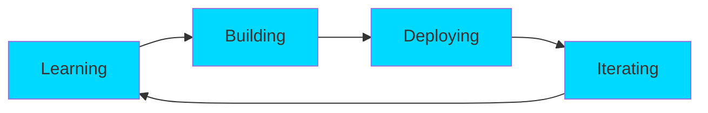

<div align="center">
  
</div>

<div align="center">
  
[](https://git.io/typing-svg)

</div>

<p align="center">
  
  
  
</p>

---

## About Me

```javascript
const mip = {
    name: "Miftahuddin S. Arsyad",
    location: "Manado, Indonesia",
    education: "Universitas Sam Ratulangi",
    role: "Full Stack Developer",
    passion: ["Web Development", "Mobile Development", "Machine Learning"],
    currentFocus: "Building awesome web applications",
    tagline: "Code is poetry written in logic",
    workingOn: "Innovative web solutions",
    learning: ["Advanced React Patterns", "Cloud Architecture", "AI/ML"],
    askMeAbout: ["Web Dev", "Tech", "Cat"],
    funFact: "I debug with console.log() and I'm not ashamed"
};

console.log("Welcome to my digital world!");
```

<div align="center">


###  My Coding Journey
  


</div>

---

## Tech Arsenal

<div align="center">

### Languages & Frameworks


### Databases & Cloud


### Tools & Others


</div>

---

## GitHub Analytics

<div align="center">
  
  
</div>

<div align="center">
  
</div>

<div align="center">
  
</div>

---

## Featured Projects

<div align="center">

[](https://github.com/Codift05/BioKonversi.App)
[](https://github.com/Codift05/K-Means-Clustering)

</div>

---

## Current Focus

<div align="center">



</div>

---

## Let's Connect & Collaborate

<div align="center">

<a href="https://www.instagram.com/mfthsarsyd">
  
</a>
<a href="mailto:miftahsarsyd@gmail.com">
  
</a>
<a href="https://github.com/Codift05">
  
</a>
<a href="https://www.linkedin.com/in/miftahuddin-s-arsyad/">
  
</a>

</div>

---

<div align="center">

### Developer's Wisdom


### Contribution Snake

<picture>
  <source media="(prefers-color-scheme: dark)" srcset="https://raw.githubusercontent.com/Codift05/Codift05/output/github-contribution-grid-snake-dark.svg">
  <source media="(prefers-color-scheme: light)" srcset="https://raw.githubusercontent.com/Codift05/Codift05/output/github-contribution-grid-snake.svg">
  
</picture>

<br><br>

**Codift05**


</div>
