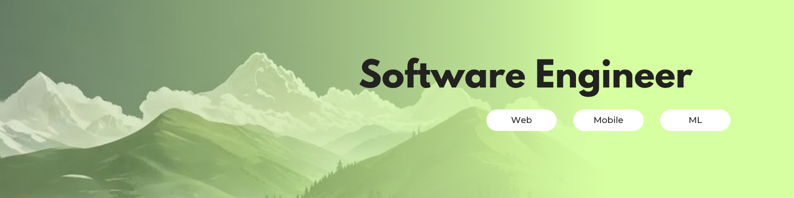
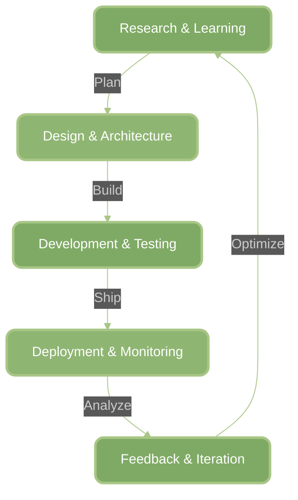

<div align="center">
  
  

<div align="center">

</div>

<p align="center">
  
  
  
</p>

---

##  About Me

<div align="center">

<table>
<tr>
<td width="50%" valign="top">

### Professional Profile

```typescript
interface Developer {
  name: string;
  location: string;
  role: string;
  education: string;
  experience: string[];
}

const profile: Developer = {
  name: "Miftahuddin S. Arsyad",
  location: "Manado, Indonesia",
  role: "Full Stack Developer",
  education: "Universitas Sam Ratulangi",
  experience: [
    "Web Development",
    "Mobile Development", 
    "Machine Learning"
  ]
};
```

</td>
<td width="50%" valign="top">

### Current Status

```python
class CurrentFocus:
    def __init__(self):
        self.working_on = "Scalable Web Applications"
        self.learning = [
            "Advanced React Patterns",
            "Cloud Architecture",
            "AI/ML Integration"
        ]
        self.interests = [
            "System Design",
            "Performance Optimization",
            "Developer Experience"
        ]
    
    def get_motto(self):
        return "Code is poetry written in logic"
```

</td>
</tr>
</table>

<br>

### Technical Expertise

<table>
<tr>
<td align="center" width="33%">
  <br>
  
  <br><br>
  <sub><b>React • Next.js • TypeScript</b></sub>
  <br>
  <sub>Tailwind CSS • Three.js</sub>
  <br><br>
</td>
<td align="center" width="33%">
  <br>
  
  <br><br>
  <sub><b>Node.js • Express • Python</b></sub>
  <br>
  <sub>GraphQL • REST APIs</sub>
  <br><br>
</td>
<td align="center" width="33%">
  <br>
  
  <br><br>
  <sub><b>Docker • Git • CI/CD</b></sub>
  <br>
  <sub>Cloud Deployment</sub>
  <br><br>
</td>
</tr>
</table>

</div>

<br>

<div align="center">


###  Coding Statistics
  


</div>

---

## 🛠️ Technology Stack

<div align="center">

<table>
<tr>
<td align="center" width="25%">
<br>
<h3>Languages & Frameworks</h3>
<br>
<p>
  
  
  
  
  
</p>
<br>
</td>
<td align="center" width="25%">
<br>
<h3>Frontend Development</h3>
<br>
<p>
  
  
  
  
</p>
<br>
</td>
<td align="center" width="25%">
<br>
<h3>Backend & Database</h3>
<br>
<p>
  
  
  
  
  
</p>
<br>
</td>
<td align="center" width="25%">
<br>
<h3>Tools & Platforms</h3>
<br>
<p>
  
  
  
  
</p>
<br>
</td>
</tr>
</table>

</div>

---

## GitHub Analytics

<div align="center">
  
  
</div>

<div align="center">
  
</div>

<div align="center">
  
</div>

---

## Featured Projects

<div align="center">

[](https://github.com/Codift05/BioKonversi.App)
[](https://github.com/Codift05/K-Means-Clustering)

</div>

---

##  Current Focus

<div align="center">

<table>
<tr>
<td width="50%">

###  What I'm Building
```typescript
const currentProjects = {
   webApp: "Next.js E-Commerce Platform",
   mobileApp: "React Native Fitness Tracker",
   aiProject: "Machine Learning Chatbot",
   status: "In Active Development"
};
```

</td>
<td width="50%">

###  What I'm Learning
```python
learning_path = {
    "frontend": ["Next.js 15", "Three.js"],
    "backend": ["GraphQL", "Microservices"],
    "devops": ["Docker", "Kubernetes"],
    "ai_ml": ["TensorFlow", "PyTorch"]
}
```

</td>
</tr>
</table>

<br>

### Development Cycle


```mermaid
%%{init: {'theme':'dark', 'themeVariables': { 'primaryColor':'#7FAA65', 'primaryTextColor':'#fff', 'primaryBorderColor':'#8FB573', 'lineColor':'#A8C686', 'secondaryColor':'#1a1b27', 'tertiaryColor':'#2d2e3a', 'fontSize':'16px'}}}%%
flowchart TD
    A[Research & Learning]
    B[Design & Architecture]
    C[Development & Testing]
    D[Deployment & Monitoring]
    E[Feedback & Iteration]
    
    A -->|Plan| B
    B -->|Build| C
    C -->|Ship| D
    D -->|Analyze| E
    E -->|Optimize| A
    
    style A fill:#7FAA65,stroke:#A8C686,stroke-width:3px,color:#fff,rx:10
    style B fill:#8FB573,stroke:#A8C686,stroke-width:3px,color:#fff,rx:10
    style C fill:#7FAA65,stroke:#A8C686,stroke-width:3px,color:#fff,rx:10
    style D fill:#8FB573,stroke:#A8C686,stroke-width:3px,color:#fff,rx:10
    style E fill:#7FAA65,stroke:#A8C686,stroke-width:3px,color:#fff,rx:10
```

<br>

<table>
<tr>
<td align="center" width="20%">
  
  <br><sub>Technology exploration and requirements analysis</sub>
</td>
<td align="center" width="20%">
  
  <br><sub>System architecture and solution planning</sub>
</td>
<td align="center" width="20%">
  
  <br><sub>Implementation with clean code practices</sub>
</td>
<td align="center" width="20%">
  
  <br><sub>Production release and monitoring</sub>
</td>
<td align="center" width="20%">
  
  <br><sub>Continuous improvement cycle</sub>
</td>
</tr>
</table>

<br>


###  Current Sprint Goals

<table>
<tr>
<td align="center" width="25%">
  <svg width="60" height="60" viewBox="0 0 24 24" fill="none" xmlns="http://www.w3.org/2000/svg">
    <rect width="24" height="24" rx="6" fill="#7FAA65" fill-opacity="0.2"/>
    <path d="M8 7h8M8 12h8M8 17h5" stroke="#7FAA65" stroke-width="2" stroke-linecap="round"/>
  </svg>
  <br><strong>Code Quality</strong>
  <br><sub>Write clean, maintainable code</sub>
</td>
<td align="center" width="25%">
  <svg width="60" height="60" viewBox="0 0 24 24" fill="none" xmlns="http://www.w3.org/2000/svg">
    <rect width="24" height="24" rx="6" fill="#8FB573" fill-opacity="0.2"/>
    <circle cx="12" cy="12" r="8" stroke="#8FB573" stroke-width="2"/>
    <path d="M12 8v4l3 3" stroke="#8FB573" stroke-width="2" stroke-linecap="round"/>
  </svg>
  <br><strong>Daily Learning</strong>
  <br><sub>1 hour of focused learning</sub>
</td>
<td align="center" width="25%">
  <svg width="60" height="60" viewBox="0 0 24 24" fill="none" xmlns="http://www.w3.org/2000/svg">
    <rect width="24" height="24" rx="6" fill="#A8C686" fill-opacity="0.2"/>
    <path d="M12 3l9 18H3l9-18z" stroke="#A8C686" stroke-width="2" stroke-linecap="round" stroke-linejoin="round"/>
    <path d="M12 9v6M12 18h.01" stroke="#A8C686" stroke-width="2" stroke-linecap="round"/>
  </svg>
  <br><strong>Ship Features</strong>
  <br><sub>Deploy weekly improvements</sub>
</td>
<td align="center" width="25%">
  <svg width="60" height="60" viewBox="0 0 24 24" fill="none" xmlns="http://www.w3.org/2000/svg">
    <rect width="24" height="24" rx="6" fill="#7FAA65" fill-opacity="0.2"/>
    <circle cx="9" cy="7" r="3" stroke="#7FAA65" stroke-width="2"/>
    <circle cx="15" cy="17" r="3" stroke="#7FAA65" stroke-width="2"/>
    <path d="M9 10v7M15 14V7" stroke="#7FAA65" stroke-width="2" stroke-linecap="round"/>
  </svg>
  <br><strong>Contribute</strong>
  <br><sub>Open source contributions</sub>
</td>
</tr>
</table>

</div>

---

## Let's Connect & Collaborate

<div align="center">

<a href="https://www.instagram.com/mfthsarsyd">
  
</a>
<a href="mailto:miftahsarsyd@gmail.com">
  
</a>
<a href="https://github.com/Codift05">
  
</a>
<a href="https://www.linkedin.com/in/miftahuddin-s-arsyad/">
  
</a>

</div>

---

<div align="center">

### Developer's Wisdom


### Contribution Snake

<picture>
  <source media="(prefers-color-scheme: dark)" srcset="https://raw.githubusercontent.com/Codift05/Codift05/output/github-contribution-grid-snake-dark.svg">
  <source media="(prefers-color-scheme: light)" srcset="https://raw.githubusercontent.com/Codift05/Codift05/output/github-contribution-grid-snake.svg">
  
</picture>

<br><br>

**Codift05**

</div>
