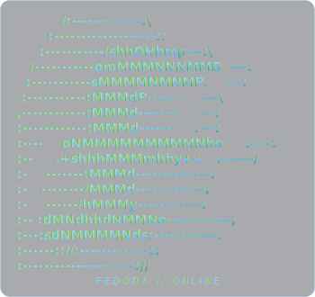

<code>Computer Science Student · Software Developer · Indonesia</code>

 

<table>
<tr>
<td valign="middle">

</td>
<td valign="middle">
<h3><code>Codift05</code></h3>
<pre>
Status   Error 404
Host     GitHub / Codift05
Role     CS Student &amp; Developer
Location Indonesia

Focus    Software Engineering
         Artificial Intelligence
         Data Science

Status   Building. Learning. Shipping.
Kernel   Coffee-powered
</pre>

  &nbsp;&nbsp;
  &nbsp;&nbsp;
  

</td>
</tr>
</table>

## `> tech --list`

 

<table>
<tr>
<td align="center">
  <a href="https://github.com/Codift05/BioKonversi.App"><b>BioKonversi.App</b></a>
   Digital bioconversion application
</td>
<td align="center">
  <a href="https://github.com/Codift05/K-Means-Clustering"><b>K-Means Clustering</b></a>
   Data clustering implementation
</td>
</tr>
</table>

 

<picture>
  <source media="(prefers-color-scheme: dark)" srcset="https://raw.githubusercontent.com/Codift05/Codift05/output/github-contribution-grid-snake-dark.svg">
  <source media="(prefers-color-scheme: light)" srcset="https://raw.githubusercontent.com/Codift05/Codift05/output/github-contribution-grid-snake.svg">
  
</picture>

 

<code>[ J.A.R.V.I.S. ] while (alive) { learn(); build(); improve(); }</code>

