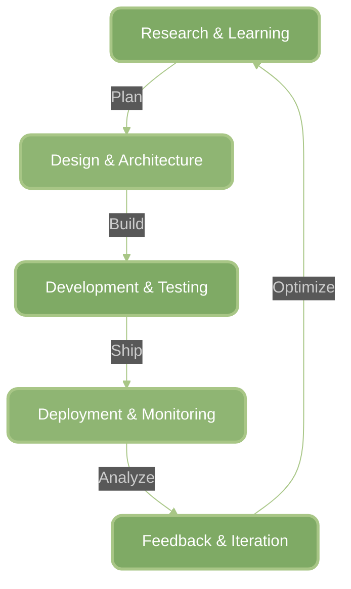

<div align="center">
  
  
  <h1>
    
  </h1>
</div>

<div align="center">
  
[](https://git.io/typing-svg)

</div>

<p align="center">
  
  
  
</p>

---

## About Me

```javascript
const mip = {
    name: "Miftahuddin S. Arsyad",
    location: "Manado, Indonesia",
    education: "Universitas Sam Ratulangi",
    role: "Full Stack Developer",
    passion: ["Web Development", "Mobile Development", "Machine Learning"],
    currentFocus: "Building awesome web applications",
    tagline: "Code is poetry written in logic",
    workingOn: "Innovative web solutions",
    learning: ["Advanced React Patterns", "Cloud Architecture", "AI/ML"],
    askMeAbout: ["Web Dev", "Tech", "Cat"],
    funFact: "I debug with console.log() and I'm not ashamed"
};

console.log("Welcome to my digital world!");
```

<div align="center">


###  My Coding Journey
  


</div>

---

## Tech Arsenal

<div align="center">

### Languages & Frameworks


### Databases & Cloud


### Tools & Others


</div>

---

## GitHub Analytics

<div align="center">
  
  
</div>

<div align="center">
  
</div>

<div align="center">
  
</div>

---

## Featured Projects

<div align="center">

[](https://github.com/Codift05/BioKonversi.App)
[](https://github.com/Codift05/K-Means-Clustering)

</div>

---

##  Current Focus

<div align="center">

<table>
<tr>
<td width="50%">

###  What I'm Building
```typescript
const currentProjects = {
   webApp: "Next.js E-Commerce Platform",
   mobileApp: "React Native Fitness Tracker",
   aiProject: "Machine Learning Chatbot",
   status: "In Active Development"
};
```

</td>
<td width="50%">

###  What I'm Learning
```python
learning_path = {
    "frontend": ["Next.js 15", "Three.js"],
    "backend": ["GraphQL", "Microservices"],
    "devops": ["Docker", "Kubernetes"],
    "ai_ml": ["TensorFlow", "PyTorch"]
}
```

</td>
</tr>
</table>

<br>

### Development Cycle



<br>

<table>
<tr>
<td align="center" width="20%">
  
  <br><sub>Technology exploration and requirements analysis</sub>
</td>
<td align="center" width="20%">
  
  <br><sub>System architecture and solution planning</sub>
</td>
<td align="center" width="20%">
  
  <br><sub>Implementation with clean code practices</sub>
</td>
<td align="center" width="20%">
  
  <br><sub>Production release and monitoring</sub>
</td>
<td align="center" width="20%">
  
  <br><sub>Continuous improvement cycle</sub>
</td>
</tr>
</table>

<br>


###  Current Sprint Goals

<table>
<tr>
<td align="center" width="25%">
  <svg width="60" height="60" viewBox="0 0 24 24" fill="none" xmlns="http://www.w3.org/2000/svg">
    <rect width="24" height="24" rx="6" fill="#7FAA65" fill-opacity="0.2"/>
    <path d="M8 7h8M8 12h8M8 17h5" stroke="#7FAA65" stroke-width="2" stroke-linecap="round"/>
  </svg>
  <br><strong>Code Quality</strong>
  <br><sub>Write clean, maintainable code</sub>
</td>
<td align="center" width="25%">
  <svg width="60" height="60" viewBox="0 0 24 24" fill="none" xmlns="http://www.w3.org/2000/svg">
    <rect width="24" height="24" rx="6" fill="#8FB573" fill-opacity="0.2"/>
    <circle cx="12" cy="12" r="8" stroke="#8FB573" stroke-width="2"/>
    <path d="M12 8v4l3 3" stroke="#8FB573" stroke-width="2" stroke-linecap="round"/>
  </svg>
  <br><strong>Daily Learning</strong>
  <br><sub>1 hour of focused learning</sub>
</td>
<td align="center" width="25%">
  <svg width="60" height="60" viewBox="0 0 24 24" fill="none" xmlns="http://www.w3.org/2000/svg">
    <rect width="24" height="24" rx="6" fill="#A8C686" fill-opacity="0.2"/>
    <path d="M12 3l9 18H3l9-18z" stroke="#A8C686" stroke-width="2" stroke-linecap="round" stroke-linejoin="round"/>
    <path d="M12 9v6M12 18h.01" stroke="#A8C686" stroke-width="2" stroke-linecap="round"/>
  </svg>
  <br><strong>Ship Features</strong>
  <br><sub>Deploy weekly improvements</sub>
</td>
<td align="center" width="25%">
  <svg width="60" height="60" viewBox="0 0 24 24" fill="none" xmlns="http://www.w3.org/2000/svg">
    <rect width="24" height="24" rx="6" fill="#7FAA65" fill-opacity="0.2"/>
    <circle cx="9" cy="7" r="3" stroke="#7FAA65" stroke-width="2"/>
    <circle cx="15" cy="17" r="3" stroke="#7FAA65" stroke-width="2"/>
    <path d="M9 10v7M15 14V7" stroke="#7FAA65" stroke-width="2" stroke-linecap="round"/>
  </svg>
  <br><strong>Contribute</strong>
  <br><sub>Open source contributions</sub>
</td>
</tr>
</table>

</div>

---

## Let's Connect & Collaborate

<div align="center">

<a href="https://www.instagram.com/mfthsarsyd">
  
</a>
<a href="mailto:miftahsarsyd@gmail.com">
  
</a>
<a href="https://github.com/Codift05">
  
</a>
<a href="https://www.linkedin.com/in/miftahuddin-s-arsyad/">
  
</a>

</div>

---

<div align="center">

### Developer's Wisdom


### Contribution Snake

<picture>
  <source media="(prefers-color-scheme: dark)" srcset="https://raw.githubusercontent.com/Codift05/Codift05/output/github-contribution-grid-snake-dark.svg">
  <source media="(prefers-color-scheme: light)" srcset="https://raw.githubusercontent.com/Codift05/Codift05/output/github-contribution-grid-snake.svg">
  
</picture>

<br><br>

**Codift05**


</div>
